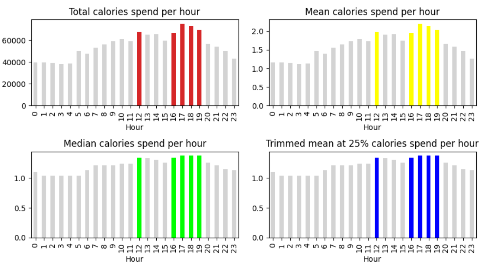
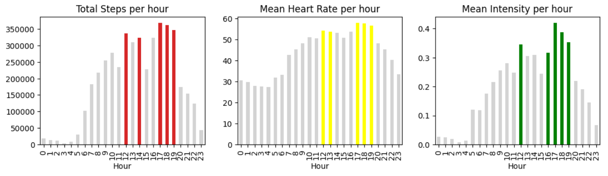
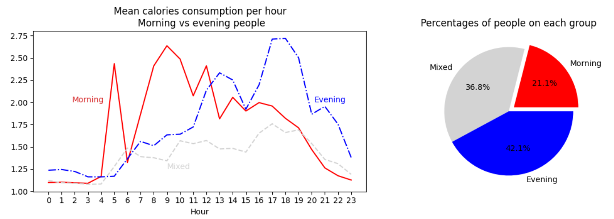
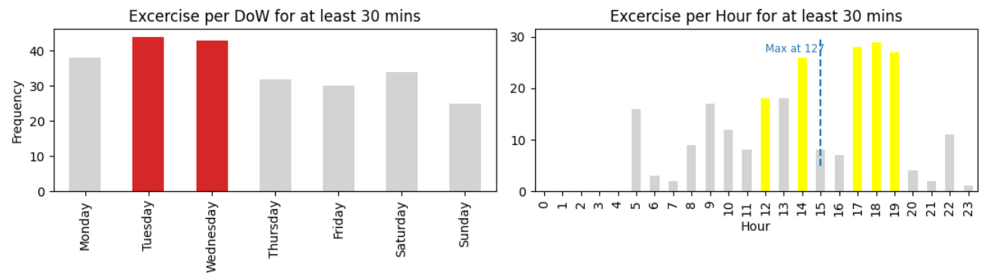
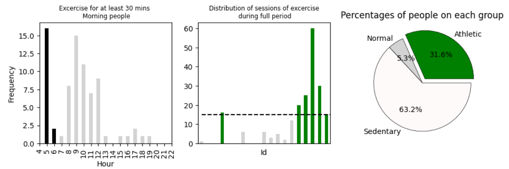
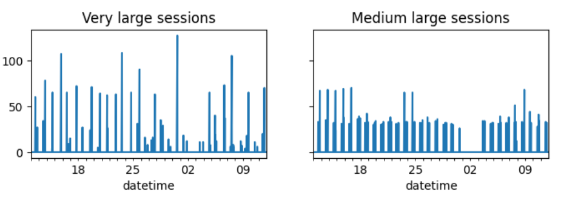
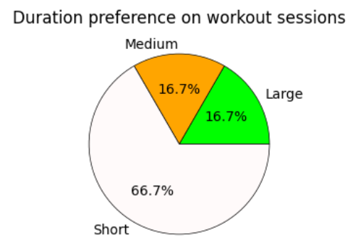
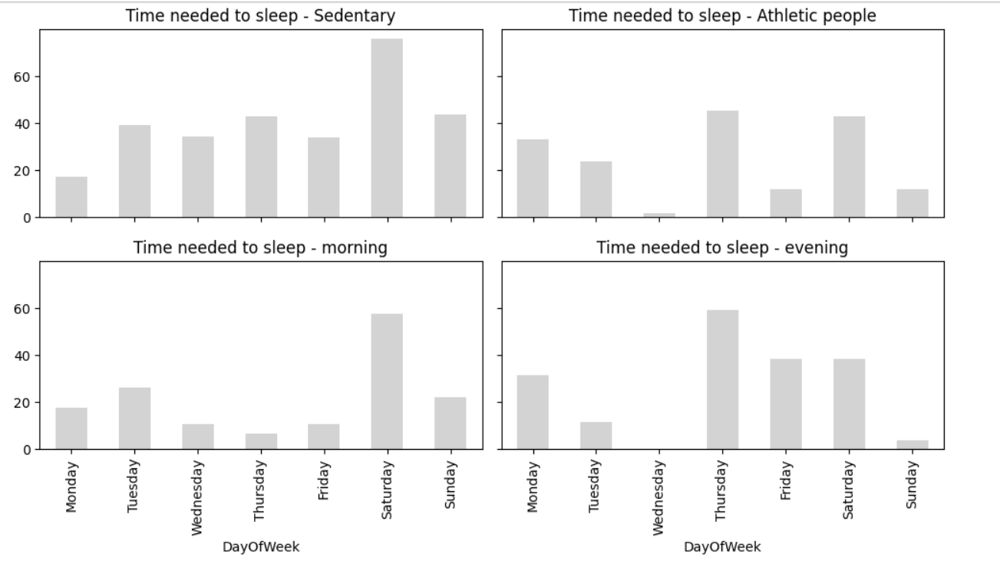
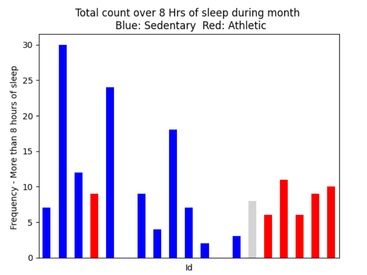
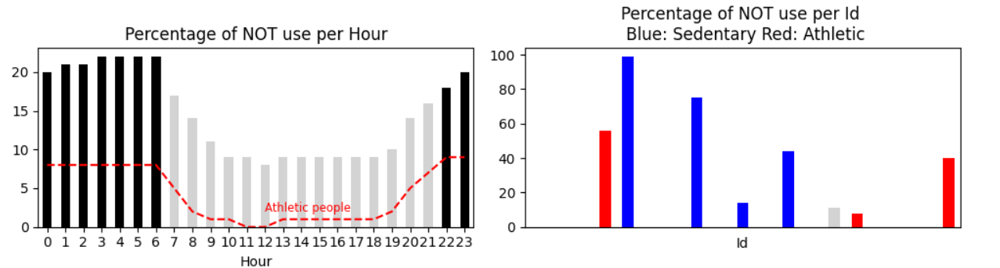

# Google Data Analysis Professional Capstone Project
- [English Version](#English-Version) 
- [Spanish Version](#Spanish-Version)

## Spanish Version

### **Problema de negocio** 📝
Este proyecto hace parte del certificado profesional de Google en análisis de datos.
Usamos el dataset de la marca _FitBit_, disponible vía [**Kaggle**](https://www.kaggle.com/datasets/arashnic/fitbit), que corresponden a registros de un dispositvo (Smartwatch) con información de consumo de calorías, número de pasos, etc.
En este caso, asumimos que trabajamos para Bellabeat, una competidora de FitBit. Nuestra tarea consiste en **identificar patrones de consumo en los usuarios de los productos FitBit** que puedan apoyar la estrategia de Marketing de la compañía.

|  |
|:--:|
| <b>Image Credits - Banner - https://www.kaggle.com/datasets/arashnic/fitbit  </b>|


### **Highlights** 
Este proyecto se hizo utlizando python 3.10.5 en un entorno de Jupyter Notebooks. Consta de tres secciones principales:
- [**Apéndice**](#Apéndice)
- [**Data Cleaning**](#Data-Cleaning)
- [**Data Analysis**](#Data-Analysis)
### Apéndice
Aquí manipulamos desde el sistema el [dataset](https://www.kaggle.com/datasets/arashnic/fitbit) con el fin de obtener todos los archivos csv como pandas dataframes. Nos dimos cuenta que la estructura de datos es similar a la de una base relacional y que ciertos dataframes son meramente agregaciones de los datos minuto a minuto. Decidimos trabajar únicamente con éstos dataframes 'raíz'. 

Tenemos información por minuto de:
* Calorías
* Intensidad de ejercicio
* METs
* Número de pasos
* Ritmo cardíaco

Información diaria de:
* Sueño
* Peso

### Data Cleaning:

0. Restringimos a 19 usuarios de los 25 originalmente disponibles. Ya que 6 usuarios tenían la información muy incompleta (no alcanzaban a cubrir un mes de datos).
1. Restringimos el rango de fechas desde 2016-04-12 hasta 2016-05-11 minuto a minuto. Esto para tener información de tiempo comparable para los distintos usuarios. Aquí se usaron todos los datos de Calorías, Intensidades, METs y Steps.
2. Interpolamos usando statistical matching registros faltantes de sueño y añadimos ruido normal para completar registros inexistentes de algunos usuarios a fin de evitar sesgo y respetar la distribución original. Datos son diarios para el mismo período. Ver nota.
3. Interpolamos datos faltantes de ritmo cardíaco usando fórmula que relaciona METs., basándonos en un método lineal robusto expuesto en [ELSEVIER- Int J Cardiol Heart Vasc.](https://www.ncbi.nlm.nih.gov/pmc/articles/PMC6003065/). Además añadimos registros inexistentes con la misma fórmula + resampleo aleatorio de los registros existentes para tener datos que respeten la distribución original de los Id's presentes. Ver nota.
4. Desestimamos el uso de los datos de Peso al ser la mayoría subjetivamente ingresados por los usuarios. Esto los hace vulnerables a sesgo o malas mediciones. Además contábamos con muy pocos registros completos (apenas 2 de 19).

Nota: Obviamente entendemos que estos datos son ficticios. En un caso real el problema de la falta de registros debería tratarse con los stakeholders. El único propósito aquí es demostrar habilidad en el uso de herramientas estadísticas. El muestreo aleatorio puede llevar a un conjunto de datos de mayor calidad, reduciendo el sesgo que únicamente usando la pequeña proporción incompleta de datos disponibles. Sin embargo, no defendemos aquí que sea una buena práctica hacer este tipo de interpolaciones.

### Data Analysis: 
Intentamos identificar patrones en el uso del dispositivo en 3 frentes:
* A) Ejercicio
* B) Sueño
* C) Tiempo de uso

#### A) Ejercicio
Logramos identificar las horas de mayor consumo calórico, usando agregaciones con diferentes estadísticos:



Este mismo patrón se comprueba con otras variables:


Sin embargo, al observar la media truncada vemos que los valores son más cercanos entre sí. Indicando que la mayor actividad en la tarde se debe a altos valores para algunos usarios a dichas horas.

Dado lo anterior, decidimos clasificar a los usuarios de acuerdo a sus horas más activas durante el mes.



- El **21%** de los usarios son **más activos en la mañana** (i.e. antes de las 11:00 hrs.)
- **31%** son **mixtos**. Es decir tienen al menos una hora activa antes de las 11 pero no más de 2.
- La mayoría, el **42%** prefieren las horas de la tarde.

Otros descubrimeintos, las 5:00 y las 9:00 son las horas preferidas para los usarios de la mañana. Desde las 17:00 hasta las 19:00 los usarios de la tarde suelen ser más activos. Los usuarios mixtos más bien no tienen una hora preferida para estar activos y suelen ser más sedentarios.

En cuanto a los días de la semana no encontramos patrones particulares, solamente:
* El domingo es el día menos activo. 
* Curiosamente los usuarios de la mañana prefieren estar más activos lunes, martes y miércoles.

Ahora bien , que una persona esté más activa, es decir que consuma más calorías, no significa que esté haciendo una rutina de ejercicio.
Por eso calculamos las rachas de minutos consecutivos que las personasn tenían una intensidad de 2 o 3 (medianamente a altamente axctivos). Consideramos rachas de 30 minutos como una sesión de ejercicio. Estos fueron nuestros descubrimientos:



* Claramente, dado que hay más usuarios de la tarde, las horas de más ejercicio fueron las de la tarde. Confirmamos que las horas preferidas para ejercitarse en la tarde son desde las 17:00 hasta las 19:00.
* Los días que los usarios prefieren hacer ejericio son los primeros días de la semana de trabajo. Se ejercitan menos los viernes y domingos.

Invesitgano aún más este aspecto decidimos clasificar a las personas de acuerdo al número de sesiones de más de 30 minutos que tuvieron durante el mes (período de 30 días). 
* Personas con 15 o más sesiones fueron clasificadas como atléticas.
* Entre 8 y 14 como normal.
* Menor o igual a 7 como sedentarios.


La línea de la gráfica del medio indica el umbral de 15 sesiones en un mes que debe superar una persona para considerarse atlética. Hubo alguine con 60 sesiones.

Descubrimos que:
* El **31%** de los usarios hacen ejercicio constantemente. Son atléticos.
* El **63% son sedentarios**.
* Validamos nuestra hipótesis de que las horas favoritas para tener actividad para los ususarios de la mañana son las 5:00 y las 9:00, pues éstas horas fueron también las de mayor número de sesiones de ejercicio. También indica que hay súper madrugadores y personas de media mañana dentro de ese grupo del **21%** de usuarios.

Invesitgando aún más los patrones de ejercicio, nos preguntamos: **¿Prefieren sesiones largas de ejercicio o sesiones cortas**? esto podría ser un indicador de si alguien prefiere hacer cardio, (tipo entrenamiento para maratón) o prefiere hacer ejercicio de pesas.

Por ejemplo, es claro que los siguientes usarios tienen patrones diferentes:


El de la izquierda prefiere sesiones largas y el de la derecha sesiones medias. Así pues decidimos clasificar aún más a las personas atléticas:

* Un porcentaje de al menos 20% de sesiones de más de 80 minutos como preferencia a sesiones largas.
* Un porcentaje de al menos 40% de sesiones de más de 50 minutos como preferencia a sesiones medias.
* Un porcentaje superior al 60% de sesiones inferiores a 50 minutos como preferencia sesiones cortas.

Estos fueron nuestros descubrimientos:


* Dentro de los usarios atléticos el **66%** prefiere sesiones cortas.

#### Conclusiones A)

Hemos podido identificar usuarios con todo tipo de preferencias: desde mayor actividad en las mañanas o en las tardes, hasta las duraciones preferidas para hacer ejercicio. En términos generales el 63% de los usarios son sedentarios y entre los que se ejercitan la preferencia es hacia sesiones en la tarde de no más de 50 minutos y preferiblemente los días lunes, martes y miércoles. Los domingos son los días más sedentarios para todos los usarios.

#### B) Sueño

Aquí agrupamos diariamente algunas variables de interés:

* La suma total diaria de: METs, Pasos, Ritmo Cardíaco y Calorías.
* El promedio de la intensidad diario.
* La cadena de minutos de ejericio más larga por día.


No encontramos ninguna relación interesante entre el tiempo de sueño y ninguno de los grupos que hemos identificado. Ni sobre los atléticos o sendentarios, ni sobre las personas más activas en la mañana o sobre las personas más activas en la tarde. En todos las casos la correlación de Pearson fue inferior en valor absoluto a 0.3 con respecto a cada una de las otras variables de interés.

Por otra parte, en cuánto a la diferencia de Tiempo en cama y tiempo de sueño sí notamos diferencias significativas:



Descubrimos que **Tanto las personas sedentarias como las personas activas en la tarde les toma más tiempo irse a dormir que a las personas atléticas y las personas que realizan la mayor actividad física en las mañanas**

Podemos decir, que para esta muestra particular uno de los beneficios del producto es que ayuda a mejorar los hábitos del sueño cunado se combina con actividad física.

Lo recomendable es tener 8 horas de sueño. Es decir 480 minutos de sueño díarios. Vamos a realizar un conteo de todos los días que los usuarios superan dicha marca.



Ahora vemos que los resultados anteriores pueden estar sesgados por el hecho de que las personas atléticas no suelen dormir más de 8 horas. O también puede deberse a que durante la noche las personas se quitan su reloj porque les molesta al dormir. Eso nos sirve de introducción hacia la siguiente pregunta: ¿Qué tanto usan los usuarios sus dispostivos?

#### C) Uso dispostivo
En esta sección consideraremos las cadenas largas donde el ritmo cardiaco marca un valor de cero. Esto significará que la persona se quitó el dispositivo. Consideramos que una persona se quitó el dispositivo en una hora dada si en algún momento de dicha hora su **ritmo cardíaco fue de 0 por al menos 15 minutos consecutivos**.



Hemos descubierto que:

* **20%** del tiempo en horas de la noche y de la mañana los usuarios simplemente no usaron su dispositivo.
* **2 de 6 usuarios atléticos** tuvieron un uso del dispositvo **inferior al 60% de todas las horas posible**. Es posible que éstos usuarios solo usen el dispositivo para sus sesiones de entrenamiento. En particular el usuario de preferencia de sesiones largas, usó su dispositvo solamente el 60% del tiempo.
* Confirmamos nuestra hipótesis de que las personas atléticas también tienden a quitarse el dispositivo de noche.
* Es evidente que 5 de los 19 usuarios, es decir **un 26% no llegan a usar el dispositvo un 60% del tiempo.**

### Requerimientos
 * Descargar el dataset desde [Kaggle Fit Bit](https://www.kaggle.com/datasets/arashnic/fitbit)
 * Se usó Python 3.10.5 y las siguientes librerías:
 ```
pandas
numpy 
from scipy.stats import trim_mean
matplotlib.pyplot
seaborn
 ````

## English Version